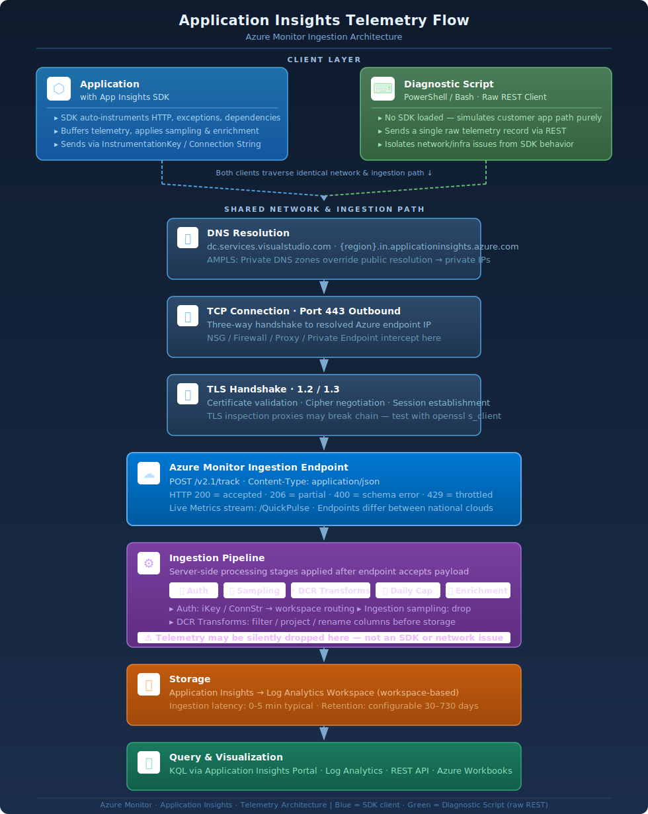

# Architecture: Application Insights Telemetry Flow

This document explains the end-to-end path that telemetry takes from your
application to queryable data in Azure Monitor. Understanding this flow is
essential for diagnosing where data loss occurs and why.

The diagnostic scripts (`Test-AppInsightsTelemetryFlow.ps1` and
`test-appinsights-telemetry-flow.sh`) walk this path step by step, testing
each layer independently. This document describes the layers, what can go
wrong at each one, and how the scripts detect it.

---

## Telemetry Flow Overview

At a high level, telemetry travels from your applications, or this diagnostic script, through the following stages:



Each box represents a layer that can independently fail, degrade, or silently
drop data. The scripts test every layer from top to bottom.

---

## The "4D" Symptoms

Unexpected telemetry behaviors map
to one of four observable symptom categories. These are the **4D symptoms** —
they describe what users *experiences* before anyone knows which layer
is at fault:

| Symptom | What the Customer Reports | Examples |
|---------|--------------------------|----------|
| **Drops** | Telemetry is missing — fully, partially, intermittently, or just a single record. | "We stopped seeing requests after 2 PM." "About 30 % of our dependency calls are missing." "One specific custom event never shows up." |
| **Delayed** | Data eventually appears but takes far longer than the normal 0-5 minute window. | "Our alerts fire 45 minutes late." "Data from last night just appeared this morning." |
| **Duplicates** | The same telemetry item appears more than once in query results. | "Every request record is doubled." "We see two copies of each trace since we enabled Diagnostic Settings." |
| **Discrepancies** | Records arrive but field values are missing, altered, or unexpected. | "The `customDimensions` we set in code are gone." "Our `cloud_RoleName` changed after the migration." |

### How the 4D Symptoms Map to the Architecture

Each symptom can be caused by failures at different layers. The table below
shows the most common root causes per symptom:

| Symptom | Common Layers Involved | Common Root Causes |
|---------|----------------------|--------------------|
| **Drops** | DNS, TCP, TLS, Ingestion Endpoint, Ingestion Pipeline, Storage | Firewall blocking port 443, daily cap reached, ingestion sampling, workspace deleted/changed, AMPLS network isolation rejecting traffic |
| **Delayed** | Ingestion Pipeline, Storage | Ingestion pipeline backlog, SDK offline buffering then bulk retry, transient high latency under load, large batch sizes with infrequent flushes |
| **Duplicates** | Ingestion Pipeline, Storage, Query Surface | Diagnostic Settings exporting a copy to the same workspace, SDK retry after timeout (server accepted but client retried), multiple SDKs instrumenting the same app |
| **Discrepancies** | Ingestion Pipeline, Storage | DCR workspace transforms reshaping or dropping fields, SDK TelemetryInitializers or Processors overwriting properties |

### What the Scripts Diagnose

The diagnostic scripts focus on the infrastructure path — layers 2 through 8
in the diagram above. They detect the most common *infrastructure* causes of
each 4D symptom:

| Symptom | Script Detects |
|---------|----------------|
| **Drops** | DNS failure, TCP blocked, TLS failure, ingestion HTTP errors (400/401/403/429), daily cap reached (AI and LA), workspace deleted/suspended, AMPLS ingestion blocked, subscription suspended, ingestion sampling percentage reported |
| **Delayed** | E2E verification latency measurement (send → queryable timing), manual KQL query provided when automated polling times out |
| **Duplicates** | Diagnostic Settings exporting telemetry to the same or a second LA workspace |
| **Discrepancies** | DCR workspace transforms detected via Resource Graph |

> **Scope note:** The scripts test the *network and backend configuration*
> path. Symptoms caused by SDK-level issues (client-side sampling, incorrect
> TelemetryInitializer code, SDK not initialized, offline buffering behaviour)
> are outside the network path and won't be detected. When the scripts report
> a fully healthy path, the next step is to investigate the application and SDK
> layer — enable [SDK self-diagnostics](https://learn.microsoft.com/troubleshoot/azure/azure-monitor/app-insights/telemetry/enable-self-diagnostics) and [SDK stats](https://learn.microsoft.com/azure/azure-monitor/app/sdk-stats) to investigate the SDK further
> or see the troubleshooting links in the script's footer.

---

## Layer-by-Layer Breakdown

### 1. Application / SDK Layer

**What happens:** The Application Insights SDK (or auto-instrumentation agent) 
loaded in your application process collects telemetry -- requests, dependencies, 
exceptions, traces, metrics, availability results -- and serializes it into JSON 
envelopes. The SDK batches these envelopes and sends them to the ingestion endpoint 
specified in your connection string.

**What can go wrong:**
- Connection string not set or misconfigured
- SDK disabled or not initialized
- Sampling configured in SDK (client-side) reducing volume
- Auto-instrumentation agent saw app was already manually instrumented and backed off

**What the scripts check:**
- Connection string format validation and endpoint extraction
- Environment variable auto-detection (`APPLICATIONINSIGHTS_CONNECTION_STRING`,
  `APPINSIGHTS_INSTRUMENTATIONKEY`)
- Instrumentation key GUID format validation

> **Note:** The scripts do not inspect your application code or SDK
> configuration directly. They test the network and backend path that the SDK
> would use. If the scripts show a healthy path but you're still missing data,
> the issue is likely in SDK initialization, sampling configuration, application 
> issues or telemetry filtering in your application code. Enable [SDK self-diagnostics](https://learn.microsoft.com/troubleshoot/azure/azure-monitor/app-insights/telemetry/enable-self-diagnostics) 
> and [SDK stats](https://learn.microsoft.com/azure/azure-monitor/app/sdk-stats) to investigate the SDK further

---

### 2. DNS Resolution Layer

**What happens:** Before the SDK can connect, the OS resolver must translate
the ingestion endpoint's hostname (e.g., `{region}.in.applicationinsights.azure.com`)
into an IP address.

**What can go wrong:**
- DNS server unreachable or misconfigured
- Private DNS zone missing or misconfigured (AMPLS scenarios)
- DNS returning public IP when private IP expected (or vice versa)
- Split-horizon DNS not resolving correctly from the application's network
- Custom DNS server not forwarding to public DNS servers to resolve Azure domains correctly

**Endpoints resolved:**

The scripts resolve all Azure Monitor endpoints your SDK may contact, not just
the ingestion endpoint:

| Category | Example FQDN | Purpose |
|----------|---------------|---------|
| **Ingestion (Regional)** | `{region}.in.applicationinsights.azure.com` | Primary telemetry delivery |
| **Ingestion (Global/Legacy)** | `dc.applicationinsights.azure.com` | Fallback/legacy ingestion |
| **Live Metrics** | `{region}.livediagnostics.monitor.azure.com` | Real-time metrics stream |
| **Profiler** | `profiler.monitor.azure.com` | .NET Profiler trace upload |
| **Snapshot Debugger** | `snapshot.monitor.azure.com` | Exception snapshot upload |
| **Query API** | `api.applicationinsights.io` | Data plane KQL queries |
| **JS SDK CDN** | `js.monitor.azure.com` | Browser SDK script delivery |

**Why this matters for Private Link (AMPLS):**

In AMPLS configurations, DNS resolution is the critical junction. The same
hostname must resolve to a **private IP** from inside the VNet and a
**public IP** from outside. If DNS returns the wrong IP type, traffic either
fails (private-only mode) or routes incorrectly. The scripts classify every
IP as public or private and flag mismatches.

---

### 3. TCP Connectivity Layer (Port 443)

**What happens:** After DNS resolution, the OS establishes a TCP connection to
the resolved IP on port 443. This is a three-way handshake (SYN → SYN-ACK → ACK).

**What can go wrong:**
- Network Security Group (NSG) blocking outbound port 443
- Azure Firewall or network virtual appliance (NVA) dropping packets
- User-Defined Route (UDR) sending traffic to a blocking virtual appliance
- On-premises firewall blocking the connection
- Corporate proxy requiring explicit configuration
- Connection timeout due to asymmetric routing

**What the scripts check:**
- TCP connection to port 443 for every resolved endpoint
- Connection latency measurement
- Timeout detection (5-second threshold)

**Smart skip logic:** If TCP to the ingestion endpoint fails, the scripts
automatically skip TLS handshake and ingestion tests for that endpoint. There
is no point waiting 10+ seconds for a TLS timeout when the TCP layer is
already broken.

---

### 4. TLS Handshake Layer

**What happens:** Once TCP connects, the client and server negotiate a TLS
session. This includes protocol version negotiation, certificate exchange, and
symmetric key establishment.

**What can go wrong:**
- TLS inspection proxy re-signing certificates (MITM)
- Proxy downgrading TLS version (1.2 → 1.0/1.1)
- Untrusted root CA (self-signed or corporate CA not in trust store)
- Azure Monitor rejecting TLS < 1.2
- Network appliance modifying or terminating the TLS session

**What the scripts check:**
- TLS 1.2 and 1.3 negotiation (current/required)
- TLS 1.0 and 1.1 probing (deprecated, should fail against Azure)
- Certificate subject and issuer inspection
- TLS inspection / MITM detection via certificate chain analysis
- Specific proxy product identification (Zscaler, Palo Alto, Fortinet,
  Netskope, Blue Coat, etc.)
- OS-negotiated default protocol version (what the loaded App Insights SDK may also use)

**Deprecated protocol detection:**

Azure Monitor endpoints reject TLS 1.0 and 1.1. If a deprecated protocol succeeds
from the script, something between the client and Azure is terminating TLS before
traffic reaches the real endpoint. The scripts probe deprecated protocols with
a short timeout (3 seconds) specifically to detect this. If the certificate
on a deprecated connection is Microsoft-issued, it's likely an Azure edge
device (anomalous but not third-party MITM). If the certificate is
non-Microsoft, a TLS inspection proxy is in the path.

---

### 5. Ingestion Endpoint Layer

**What happens:** The SDK sends a POST request to
`https://{region}.in.applicationinsights.azure.com/v2.1/track` with a JSON
payload containing telemetry envelopes. The ingestion endpoint validates the
request and returns HTTP 200 if accepted.

**What can go wrong:**
- HTTP 400: Malformed payload or invalid instrumentation key
- HTTP 401/403: Local authentication disabled and no Entra ID token provided, or wrong private network detected
- HTTP 429: Throttling (too many requests)
- HTTP 500/503: Transient ingestion service issues
- HTTP 200 but data silently dropped (quota, sampling, or pipeline issue)
- Response body contains `itemsAccepted: 0` despite HTTP 200

**What the scripts check:**
- Send a single `availabilityResults` test record (~0.5 KB)
- Validate HTTP 200 response from the ingestion endpoint
- Parse `itemsReceived` and `itemsAccepted` from response body
- Measure round-trip latency
- Detect specific error codes and provide targeted guidance

**Why `availabilityResults`?** This telemetry type is never subject to
server-side ingestion sampling, so it provides a reliable signal. If an
availability record is accepted but never appears in storage, the issue is in
the pipeline -- not sampling.

---

### 6. Ingestion Pipeline Layer (Backend)

**What happens:** After the ingestion endpoint accepts telemetry, the data
enters the Azure Monitor ingestion pipeline. This is an internal, multi-stage
enterprise-grade large telemetry processing system that:

1. Validates and enriches the telemetry envelope
2. Applies server-side ingestion sampling (if configured)
3. Routes data through any Data Collection Rules (DCR) transforms
4. Checks daily cap limits (Application Insights and Log Analytics)
5. Writes data to the backing Log Analytics workspace

**What can go wrong:**
- **Ingestion sampling:** Configured percentage drops records probabilistically.
  At 50% sampling, roughly half of all records are discarded before storage.
- **Daily cap reached:** Application Insights and Log Analytics each have
  independent daily caps. When either is reached, new data is silently dropped
  until the cap resets (UTC midnight).
- **DCR workspace transforms:** Data Collection Rules can filter, modify, or
  drop rows via KQL transforms before they reach the workspace. A transform
  with a `where` clause can silently discard specific telemetry types.
- **Workspace deleted or suspended:** If the backing Log Analytics workspace
  is deleted or the subscription is suspended, the ingestion endpoint still
  returns HTTP 200 but data has nowhere to land.
- **Diagnostic settings duplication:** Misconfigured diagnostic settings can
  create duplicate telemetry streams that inflate costs and confuse queries.

**What the scripts check (requires Azure login):**
- Ingestion sampling percentage via resource properties
- Daily cap status for both Application Insights and Log Analytics workspace,
  including mismatch detection (AI cap vs. LA cap)
- Workspace health (deleted, suspended, provisioning state)
- DCR transform discovery via Azure Resource Graph
- Diagnostic settings configuration

> **Key insight:** The ingestion endpoint returning HTTP 200 does **not**
> guarantee data will be queryable. HTTP 200 means the front door accepted
> the envelope. The pipeline behind it can still drop the data for any of
> the reasons above including transient issues within the pipeline. This 
> is why the scripts include E2E verification as a separate step.

---

### 7. Storage Layer (Log Analytics Workspace)

**What happens:** After pipeline processing, telemetry lands in the backing
Log Analytics workspace as rows in standard tables (`requests`, `dependencies`,
`exceptions`, `traces`, `customMetrics`, `customEvents`, `availabilityResults`,
`pageViews`, `browserTimings`). Data becomes queryable after ingestion, which
typically takes 0-15 minutes but can take longer under load.

**What can go wrong:**
- Ingestion latency spike (data accepted but not yet fully ingested)
- Workspace query access disabled (AMPLS private-only mode)
- Reader RBAC role missing (can't verify data arrived)
- User running script has permissions to App Insights but not to Log Analytics and workspace permissions required

**What the scripts check:**
- E2E verification: Query the data plane API for the specific test record
  sent in step 5
- Polling with progressive backoff (up to ~65 seconds)
- Latency breakdown: time from send to queryable
- Provides KQL query for manual verification if automated check times out

---

### 8. Query Surface Layer

**What happens:** Users and dashboards query stored telemetry via the
Application Insights data plane API (`api.applicationinsights.io`) using KQL.
Azure Portal blades, workbooks, alerts, and external tools all use this
surface.

**What can go wrong:**
- AMPLS private-only query access blocking Portal queries from public networks
- API key or Entra ID token scope insufficient
- Query timeout on large datasets
- Stale data due to ingestion pipeline delays
- KQL queries are malformed or querying timeframes when telemetry is already purged

**What the scripts check:**
- DNS resolution and TCP/TLS to the query API endpoint
- Data plane query to verify the test record arrived (E2E verification)
- Response timing to detect API latency

---

## Control Plane vs. Data Plane

The scripts interact with two distinct planes of the Azure platform:

```
  ┌─────────────────────────────────────────────────────────────────────┐
  │                        CONTROL PLANE                                │
  │                   management.azure.com                              │
  │                                                                     │
  │  Azure Resource Manager (ARM)               Azure Resource Graph    │
  │  ┌─────────────────────────┐                ┌────────────────────┐  │
  │  │ GET resource properties │                │ POST cross-sub     │  │
  │  │ GET AMPLS config        │                │     resource query │  │
  │  │ GET daily cap settings  │                │                    │  │
  │  │ GET diagnostic settings │                │                    │  │
  │  │ GET workspace state     │                │                    │  │
  │  └─────────────────────────┘                └────────────────────┘  │
  │                                                                     │
  │  All operations are READ-ONLY (GET or query-only POST)              │
  │  Requires: Az.Accounts + Az.ResourceGraph + Reader RBAC             │
  │            (Azure CLI required for bash script)                     │
  └─────────────────────────────────────────────────────────────────────┘

  ┌─────────────────────────────────────────────────────────────────────┐
  │                         DATA PLANE                                  │
  │                                                                     │
  │  Ingestion API                              Query API               │
  │  ┌──────────────────────────┐              ┌─────────────────────┐  │
  │  │ POST v2.1/track          │              │ POST KQL query      │  │
  │  │ {region}.in.appinsights  │              │ api.appinsights.io  │  │
  │  │ .azure.com               │              │                     │  │
  │  │                          │              │                     │  │
  │  │ No auth required         │              │ Requires auth token │  │
  │  │ (iKey in payload)        │              │ (Az.Accounts)       │  │
  │  └──────────────────────────┘              └─────────────────────┘  │
  │                                                                     │
  │  Ingestion: unauthenticated (iKey = addressing, not security)       │
  │  Query: authenticated (Entra ID bearer token via Az.Accounts)       │
  └─────────────────────────────────────────────────────────────────────┘
```

**Why this distinction matters:**

- **Network-only mode** (`-NetworkOnly` / `--network-only`) uses only the
  data plane -- no Azure login required. It tests DNS, TCP, TLS, and the
  ingestion API.
- **Azure checks** use the control plane to discover configuration issues
  that can't be detected from the network path alone (sampling, caps,
  workspace health, AMPLS config).
- **E2E verification** crosses both planes: write via ingestion (data plane),
  then read back via query API (data plane, authenticated).

---

## Where Things Commonly Break

Based on patterns seen across thousands of support issues, here are the most
common failure points by layer:

### Network Layer Failures (Layers 2-4)

| Failure | Frequency | Detection |
|---------|-----------|-----------|
| NSG blocking port 443 to Azure Monitor IPs | Very common | TCP test fails with timeout |
| Private DNS zone missing A records | Common (AMPLS) | DNS resolves to public IP instead of private |
| TLS inspection proxy modifying certificates | Common (enterprise) | Non-Microsoft cert issuer detected |
| Custom DNS not forwarding Azure domains | Moderate | DNS resolution fails entirely |
| UDR routing traffic to wrong NVA | Moderate | TCP connects but TLS fails (wrong backend) |

### Configuration Layer Failures (Layers 5-7)

| Failure | Frequency | Detection |
|---------|-----------|-----------|
| Daily cap reached (silent drop) | Very common | Azure check reads cap status and current usage |
| Local auth disabled + no Entra token | Common | Ingestion returns HTTP 403 |
| Ingestion sampling dropping data | Rare | Azure check reads sampling percentage |
| Workspace deleted/suspended | Moderate | Workspace provisioning state check |
| DCR transform filtering rows | Moderate | Resource Graph discovers transform DCRs |
| Diagnostic settings duplication | Common | Duplicate target workspace detection |

### The "HTTP 200 but no data" Problem

This is the single most confusing scenario in Application Insights
troubleshooting. The ingestion endpoint returns HTTP 200 (accepted), but data
never appears in queries. Possible causes:

1. **Daily cap** -- Data was accepted but silently discarded at the Log Analytics daily cap limit
2. **Workspace deleted or re-created** -- Data was accepted but has nowhere to land. Re-fresh the link AI -> LA
3. **DCR transform** -- Data was accepted but filtered by a KQL `where` clause
4. **Ingestion delay** -- Data was accepted and will appear after full ingestion process

The scripts address this by:
- Sending an `availabilityResults` record (immune to ingestion sampling)
- Querying the data plane to verify the record actually arrived
- Checking all backend configuration that could cause silent drops
- Providing a manual KQL verification query with timestamp when automated
  polling times out

---

## Multi-Cloud Architecture

The scripts auto-detect the Azure cloud environment from the connection string
endpoints and adapt all behavior accordingly:

| Cloud | Ingestion Domain | Management Domain | Query Domain |
|-------|-----------------|-------------------|--------------|
| **Azure Public** | `*.in.applicationinsights.azure.com` | `management.azure.com` | `api.applicationinsights.io` |
| **Azure Government** | `*.in.applicationinsights.azure.us` | `management.usgovcloudapi.net` | `api.applicationinsights.us` |
| **Azure China** | `*.in.applicationinsights.azure.cn` | `management.chinacloudapi.cn` | `api.applicationinsights.azure.cn` |

Cloud detection is based on the TLD suffix (`.com`, `.us`, `.cn`) in the
connection string's `IngestionEndpoint` value. All DNS zones, API URLs, ARM
endpoints, and documentation links adapt automatically.

---

## AMPLS / Private Link Architecture

Azure Monitor Private Link Scope (AMPLS) changes the network path
fundamentally. Instead of traffic flowing through public endpoints, it routes
through a private endpoint in your VNet:

```
  Without AMPLS (public path):
  ┌─────┐         ┌──────────┐         ┌───────────────────┐
  │ App │──DNS──▶│ Public   │──443──▶ │ Azure Monitor     │
  │     │         │ IP       │         │ (public endpoint) │
  └─────┘         └──────────┘         └───────────────────┘

  With AMPLS (private path):
  ┌─────┐         ┌──────────┐         ┌──────────────┐         ┌───────────────────┐
  │ App │──DNS──▶│ Private  │──443──▶ │ Private      │──────▶ │ Azure Monitor     │
  │     │         │ IP       │         │ Endpoint     │         │ (AMPLS backend)   │
  └─────┘         │ (10.x)   │         │ (in VNet)    │         │                   │
                  └──────────┘         └──────────────┘         └───────────────────┘
                       ▲
                  Private DNS Zone
                  resolves FQDN to
                  private IP
```

**Critical requirements for AMPLS:**
1. Private DNS zones must exist for all Azure Monitor domains
2. DNS zones must contain A records pointing to the private endpoint IP
3. VNet must be linked to the private DNS zones
4. Custom DNS servers must forward to Azure DNS (168.63.129.16)

**Access modes:**
- **Private Only:** Only traffic from the VNet (via private endpoint) is
  accepted. Public traffic is rejected.
- **Open:** Both private and public traffic are accepted. Private DNS still
  routes VNet traffic through the private endpoint.

The scripts validate AMPLS by:
1. Discovering AMPLS resources linked to your App Insights via Resource Graph
2. Retrieving expected private endpoint IPs from ARM
3. Comparing expected IPs against actual DNS resolution from the machine
4. Reporting App Insights and AMPLS access mode settings and their operational impact
5. Assessing whether the current network location is allowed to send telemetry

See [ampls-private-link-deep-dive.md](ampls-private-link-deep-dive.md) for the
full AMPLS diagnostic reference.

---

## Script Diagnostic Flow

The scripts execute checks in a deliberate order that mirrors the telemetry
flow. Each layer depends on the previous one:

```
  1. Environment Detection
     └─▶ 2. Connection String Parsing
          └─▶ 3. DNS Resolution (all endpoints)
               └─▶ 4. TCP Connectivity (port 443)
                    └─▶ 5. TLS Handshake
                         └─▶ 6. Ingestion Test (POST v2.1/track)
                              └─▶ 7. Azure Resource Checks (AMPLS, known issues)
                                   └─▶ 8. E2E Data Plane Verification (KQL query)
                                        └─▶ 9. Diagnosis Summary
```

**Skip logic:** If a layer fails, downstream layers that depend on it are
automatically skipped. For example:
- If TCP fails → TLS and ingestion are skipped
- If ingestion fails → E2E verification is skipped
- If Az modules not found → all Azure checks are skipped

This avoids wasting time on tests that cannot succeed and prevents confusing
cascading errors.

See [diagnostic-flow.md](diagnostic-flow.md) for the detailed check ordering
rationale.

---

## Further Reading

- [diagnostic-flow.md](diagnostic-flow.md) -- Why checks are ordered this way
- [interpreting-results.md](interpreting-results.md) -- How to read the output
- [ampls-private-link-deep-dive.md](ampls-private-link-deep-dive.md) -- AMPLS deep dive
- [security-model.md](security-model.md) -- What data the scripts access and send
- [automation-ci.md](automation-ci.md) -- Using the scripts in CI/CD pipelines
