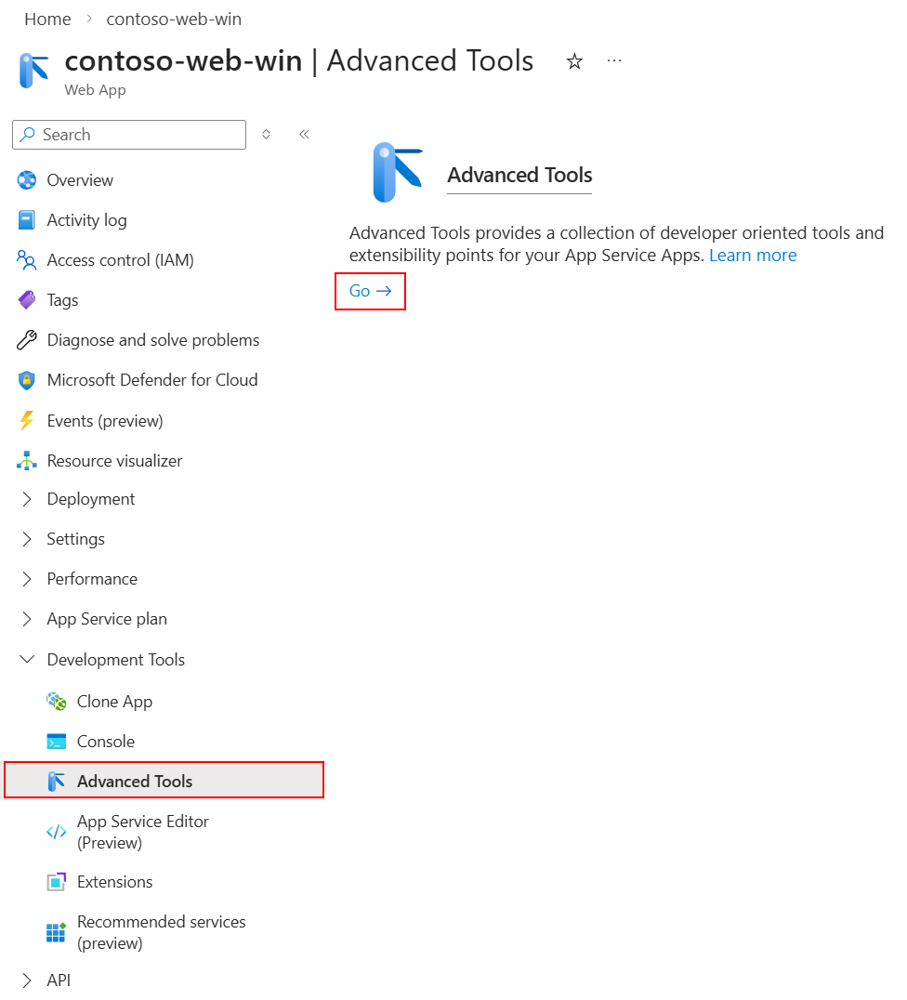
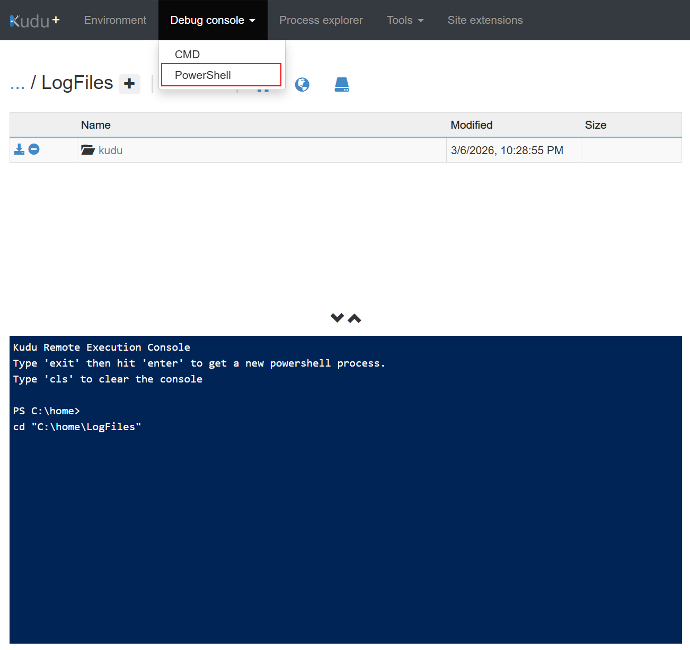
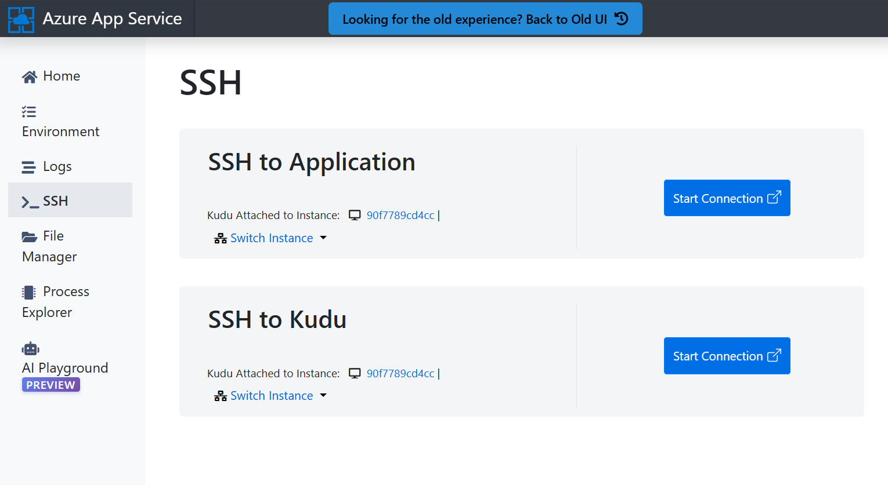
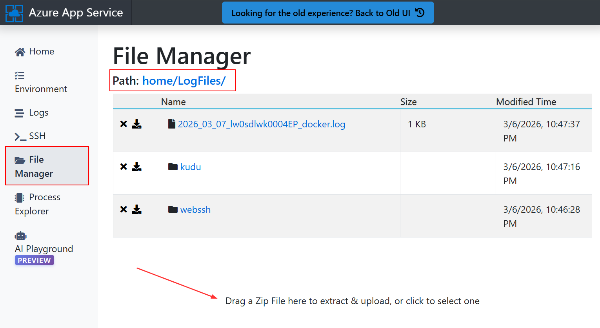
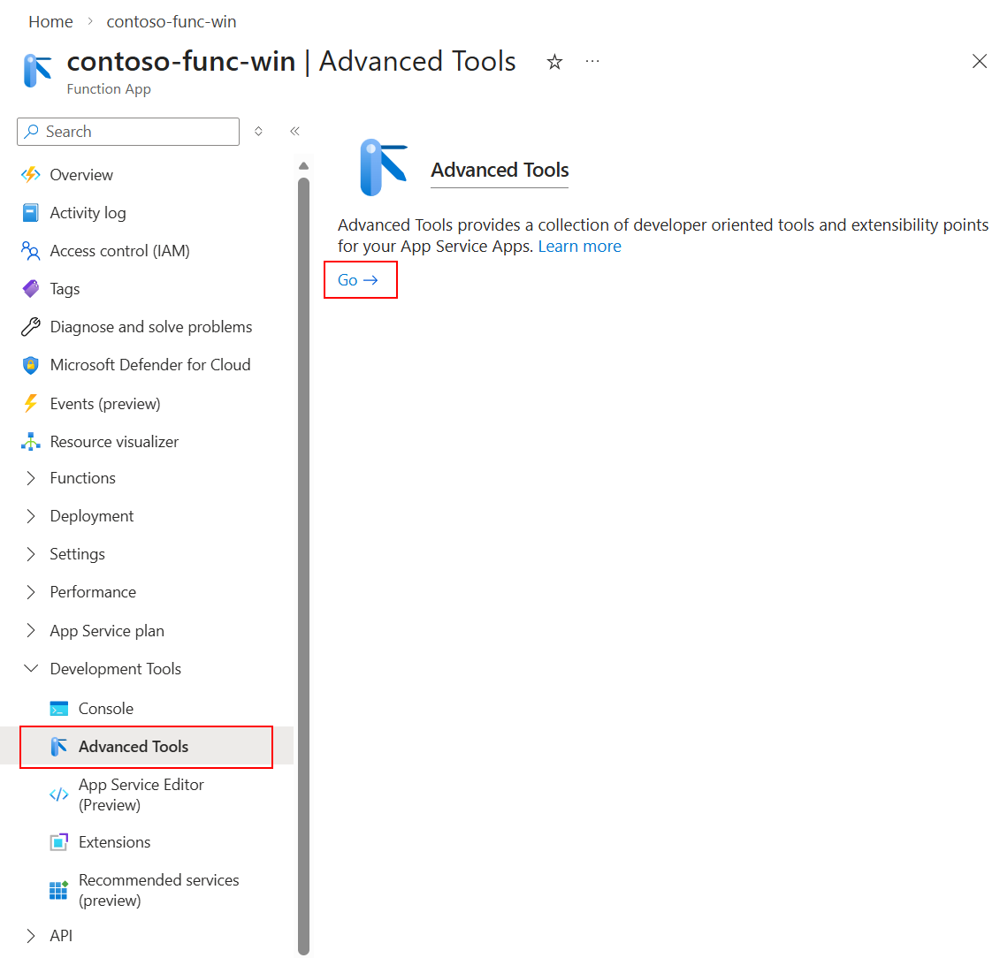
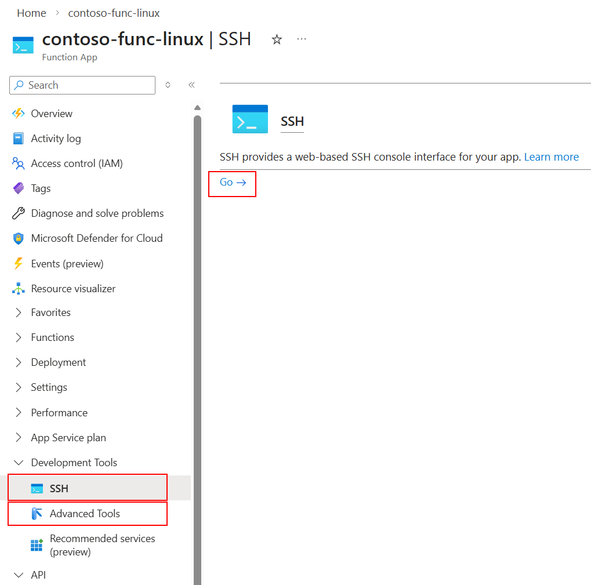

# Running the Script

> Step-by-step instructions for launching the diagnostic script from every
> Azure hosting environment where Application Insights SDKs run. Each section
> includes how to get a shell, how to transfer/run the script, and
> environment-specific notes.

---

## Table of Contents

- [Before You Start](#before-you-start)
- [Azure App Service (Windows)](#azure-app-service-windows)
- [Azure App Service (Linux)](#azure-app-service-linux)
- [Azure Functions (Windows)](#azure-functions-windows)
- [Azure Functions (Linux)](#azure-functions-linux)
- [Azure Logic Apps (Standard)](#azure-logic-apps-standard)
- [Azure Virtual Machines (Windows)](#azure-virtual-machines-windows)
- [Azure Virtual Machines (Linux)](#azure-virtual-machines-linux)
- [Azure Virtual Machine Scale Sets (VMSS)](#azure-virtual-machine-scale-sets-vmss)
- [Azure Kubernetes Service (AKS) — Linux Pods](#azure-kubernetes-service-aks--linux-pods)
- [Azure Kubernetes Service (AKS) — Windows Pods](#azure-kubernetes-service-aks--windows-pods)
- [Azure Container Apps](#azure-container-apps)
- [Azure Spring Apps](#azure-spring-apps)
- [Azure Cloud Shell](#azure-cloud-shell)
- [Local Developer Workstation (Windows)](#local-developer-workstation-windows)
- [Local Developer Workstation (macOS / Linux)](#local-developer-workstation-macos--linux)
- [Environment Feature Matrix](#environment-feature-matrix)

---

## Before You Start

**What you need:**

1. Your Application Insights **connection string** (Azure Portal → App Insights resource → Overview → Connection String).
2. Access to a shell on the machine or environment where your app is running — this is the machine whose network path you want to test.
3. [Optional — network checks work without it.] For Azure resource checks (AMPLS validation, known issue detection, or end‑to‑end verification): 

      - **PowerShell**: `Az.Accounts` and `Az.ResourceGraph` modules signed in with **Reader** access  
      *or*
      - **Bash**: Azure CLI (`az`) signed in with **Reader** access


**Which script to use:**

| Environment shell | Script |
|---|---|
| PowerShell 5.1+ (Windows) or pwsh 7+ | `Test-AppInsightsTelemetryFlow.ps1` |
| Bash 4.4+ (5.0+ recommended) with `curl` | `test-appinsights-telemetry-flow.sh` |

**Quick download commands** (used in most sections below):

```powershell
# PowerShell — download the script
Invoke-WebRequest -Uri "https://raw.githubusercontent.com/microsoft/appinsights-telemetry-flow/main/powershell/Test-AppInsightsTelemetryFlow.ps1" -OutFile "Test-AppInsightsTelemetryFlow.ps1"
```

```bash
# Bash — download the script
curl -sLO "https://raw.githubusercontent.com/microsoft/appinsights-telemetry-flow/main/bash/test-appinsights-telemetry-flow.sh"
chmod +x test-appinsights-telemetry-flow.sh
```

---

## Azure App Service (Windows)

### How to get a shell

1. In the Azure Portal, navigate to your **App Service** resource.
2. In the left menu, select **Development Tools → Advanced Tools** (Kudu).
3. Click **Go →** to open the Kudu console.
4. Select **Debug console → PowerShell** from the top menu.





### How to run the script

```powershell
# Navigate to a writable directory
# App Service instances may use C:\home or D:\home depending on the platform image
cd D:\home\LogFiles
```

**Option A — Download directly** (if the App Service has outbound access to GitHub):

```powershell
Invoke-WebRequest -Uri "https://raw.githubusercontent.com/microsoft/appinsights-telemetry-flow/main/powershell/Test-AppInsightsTelemetryFlow.ps1" -OutFile "Test-AppInsightsTelemetryFlow.ps1"
```

**Option B — Drag and drop** (if outbound access is restricted):

1. Download the script to your local machine from the [GitHub repository](https://github.com/microsoft/appinsights-telemetry-flow).
2. In the Kudu Debug Console, navigate to `D:\home\LogFiles`.
3. Drag and drop the `.ps1` file into the folder area at the top of the console.

**Option C — PowerShell Gallery**:

```powershell
Install-PackageProvider -Name NuGet -MinimumVersion 2.8.5.201 -Force -Scope CurrentUser
Save-Script -Name Test-AppInsightsTelemetryFlow -Path . -Force
```

Then run the script:

```powershell
# Run — connection string is auto-detected from APPLICATIONINSIGHTS_CONNECTION_STRING
.\Test-AppInsightsTelemetryFlow.ps1

# Or specify connection string explicitly
.\Test-AppInsightsTelemetryFlow.ps1 -ConnectionString "InstrumentationKey=..."
```

### Environment-specific notes

- The `APPLICATIONINSIGHTS_CONNECTION_STRING` environment variable is auto-detected — you often don't need to pass `-ConnectionString` at all.
- Kudu's web console lacks full color support. The script auto-detects this and switches to plain text output.
- Azure login (`Connect-AzAccount`) is not available in the Kudu console. The script will run network checks only and skip Azure resource checks gracefully. 
- Even though Azure resource checks are not possible from this environment, you can still use the `-AutoApprove` switch to auto-approve the ingestion consent prompt and send a single test telemetry record to the ingestion endpoint.
- Report files are saved to `<drive>:\home\LogFiles` by default. You can download them from Kudu's file browser.
- **Windows App Service (Basic/Standard/Premium)** runs on a dedicated VM. **Free/Shared** tiers run on shared infrastructure — network results may differ from production tiers.

---

## Azure App Service (Linux)

### How to get a shell

**Option A — SSH in Portal** (quickest):
1. In the Azure Portal, navigate to your **App Service** resource.
2. In the left menu, select **Development Tools → SSH**.
3. Click **Go →** to open an SSH session in the browser.

**Option B — Advanced Tools (Kudu)**:
1. In the Azure Portal, navigate to your **App Service** resource.
2. In the left menu, select **Development Tools → Advanced Tools** (Kudu).
3. Click **Go →** to open the Kudu dashboard, then select **SSH** from the side menu.
4. Select the instance experiencing telemetry issues (or any instance), then click **SSH to Kudu** or **SSH to Application** — either works.



> The Kudu dashboard also includes a file browser — useful for
> uploading the script (drag and drop) or downloading report files afterward.



### How to run the script

```bash
# Navigate to a writable directory
cd /home/LogFiles

# Download
curl -sLO "https://raw.githubusercontent.com/microsoft/appinsights-telemetry-flow/main/bash/test-appinsights-telemetry-flow.sh"
chmod +x test-appinsights-telemetry-flow.sh

# Run — connection string is auto-detected from APPLICATIONINSIGHTS_CONNECTION_STRING
./test-appinsights-telemetry-flow.sh

# Or specify explicitly
./test-appinsights-telemetry-flow.sh --connection-string "InstrumentationKey=..."
```

### Environment-specific notes

- Linux App Service runs inside a Docker container. The script auto-detects this and reports the container context.
- The SSH session is an in-browser web terminal. The script detects color support automatically.
- `curl` is typically pre-installed. `dig` may or may not be available depending on the container image — the script falls back to `nslookup` if `dig` is not found.
- Azure CLI (`az login`) is not available in the SSH session. Network checks only.
- Report files are saved to `/home` (which persists across restarts on Premium tiers).
- Even though Azure resource checks are not possible from this environment, you can still use the `-AutoApprove` switch to auto-approve the ingestion consent prompt and send a single test telemetry record to the ingestion endpoint.
- `jq` may not be installed on the container image. The JSON report file is still generated, but without pretty-print formatting.

---

## Azure Functions (Windows)

### How to get a shell

1. In the Azure Portal, navigate to your **Function App** resource.
2. In the left menu, select **Development Tools → Advanced Tools** (Kudu).
3. Click **Go →** to open the Kudu console.
4. Select **Debug console → PowerShell** from the top menu.



### How to run the script

```powershell
# Navigate to a writable directory
# App Service instances may use C:\home or D:\home depending on the platform image
cd D:\home\LogFiles
```

**Option A — Download directly** (if the App Service has outbound access to GitHub):

```powershell
Invoke-WebRequest -Uri "https://raw.githubusercontent.com/microsoft/appinsights-telemetry-flow/main/powershell/Test-AppInsightsTelemetryFlow.ps1" -OutFile "Test-AppInsightsTelemetryFlow.ps1"
```

**Option B — Drag and drop** (if outbound access is restricted):

1. Download the script to your local machine from the [GitHub repository](https://github.com/microsoft/appinsights-telemetry-flow).
2. In the Kudu Debug Console, navigate to `<drive>:\home\LogFiles`.
3. Drag and drop the `.ps1` file into the folder area at the top of the console.

**Option C — PowerShell Gallery**:

```powershell
Install-PackageProvider -Name NuGet -MinimumVersion 2.8.5.201 -Force -Scope CurrentUser
Save-Script -Name Test-AppInsightsTelemetryFlow -Path . -Force
```

Then run the script:

```powershell
# Run — connection string is auto-detected from APPLICATIONINSIGHTS_CONNECTION_STRING
.\Test-AppInsightsTelemetryFlow.ps1

# Or specify connection string explicitly
.\Test-AppInsightsTelemetryFlow.ps1 -ConnectionString "InstrumentationKey=..."
```

### Environment-specific notes

- Identical to [Windows App Service](#azure-app-service-windows) from a Kudu/console perspective.
- The script auto-detects Function App runtime version and extension bundle version.
- Function tiers **App Service Plan** and **Premium Plan** both provide full access to the Kudu console, allowing you to run custom scripts.
- On **Flex Consumption** or **Container Apps-hosted** plans, Kudu may not be available — use Azure Cloud Shell or a local workstation with matching VNet connectivity instead.
- Even though Azure resource checks are not possible from this environment, you can still use the `-AutoApprove` switch to auto-approve the ingestion consent prompt and send a single test telemetry record to the ingestion endpoint.

---

## Azure Functions (Linux)

### How to get a shell

**Option A — SSH in Portal** (quickest):
1. In the Azure Portal, navigate to your **Function App** resource.
2. In the left menu, select **Development Tools → SSH**.
3. Click **Go →** to open an SSH session in the browser.

**Option B — Advanced Tools (Kudu)**:
1. In the Azure Portal, navigate to your **Function App** resource.
2. In the left menu, select **Development Tools → Advanced Tools** (Kudu).
3. Click **Go →** to open the Kudu dashboard, then select **SSH** from the side menu.
4. Select the instance experiencing telemetry issues (or any instance), then click **SSH to Kudu** or **SSH to Application** — either works.



> **Note:** SSH access depends on the hosting plan and OS image. Dedicated (App Service) plans
> typically support SSH. Consumption plans on Linux may not expose SSH.

### How to run the script

```bash
cd /home/LogFiles

curl -sLO "https://raw.githubusercontent.com/microsoft/appinsights-telemetry-flow/main/bash/test-appinsights-telemetry-flow.sh"
chmod +x test-appinsights-telemetry-flow.sh

./test-appinsights-telemetry-flow.sh
```

### Environment-specific notes

- Same container-based notes as [Linux App Service](#azure-app-service-linux).
- If SSH is not available on your plan, use Azure Cloud Shell connected to the same VNet, or run from a VM/jumpbox on the same network.

---

## Azure Logic Apps (Standard)

### How to get a shell

Standard Logic Apps run on the same App Service platform.

1. In the Azure Portal, navigate to your **Logic App (Standard)** resource.
2. In the left menu, select **Development Tools → Advanced Tools** (Kudu).
3. Click **Go →**, then **Debug console → PowerShell**.

<!-- TODO: Screenshot — Portal > Logic App (Standard) > Advanced Tools -->

### How to run the script

```powershell
# Navigate to a writable directory
# App Service instances may use C:\home or D:\home depending on the platform image
cd D:\home\LogFiles
```

**Option A — Download directly** (if the App Service has outbound access to GitHub):

```powershell
Invoke-WebRequest -Uri "https://raw.githubusercontent.com/microsoft/appinsights-telemetry-flow/main/powershell/Test-AppInsightsTelemetryFlow.ps1" -OutFile "Test-AppInsightsTelemetryFlow.ps1"
```

**Option B — Drag and drop** (if outbound access is restricted):

1. Download the script to your local machine from the [GitHub repository](https://github.com/microsoft/appinsights-telemetry-flow).
2. In the Kudu Debug Console, navigate to `D:\home\LogFiles`.
3. Drag and drop the `.ps1` file into the folder area at the top of the console.

**Option C — PowerShell Gallery**:

```powershell
Install-PackageProvider -Name NuGet -MinimumVersion 2.8.5.201 -Force -Scope CurrentUser
Save-Script -Name Test-AppInsightsTelemetryFlow -Path . -Force
```

Then run the script:

```powershell
# Run — connection string is auto-detected from APPLICATIONINSIGHTS_CONNECTION_STRING
.\Test-AppInsightsTelemetryFlow.ps1

# Or specify connection string explicitly
.\Test-AppInsightsTelemetryFlow.ps1 -ConnectionString "InstrumentationKey=..."
```

### Environment-specific notes

- Standard Logic Apps share the App Service Kudu infrastructure. Same capabilities and limitations as Windows App Service.
- **Consumption** Logic Apps do not have Kudu. Run the script from Cloud Shell or a machine on the same network instead.
- Logic Apps may use a different connection string than your main web application — double-check which resource you're testing.

---

## Azure Virtual Machines (Windows)

### How to get a shell

**Option A — RDP** (interactive):
1. RDP into the VM.
2. Open **PowerShell** (or **PowerShell 7** if installed).

**Option B — Run Command** (no RDP access):
1. In the Azure Portal, navigate to your **VM** resource.
2. Select **Operations → Run command**.
3. Choose **RunPowerShellScript**.

**Option C — Azure Bastion** (jumpbox):
1. Connect via Azure Bastion in the Portal.
2. Open PowerShell from the Bastion session.

<!-- TODO: Screenshot — RDP session with PowerShell open -->
<!-- TODO: Screenshot — Portal > VM > Run command -->

### How to run the script

**Option A — Download directly:**

```powershell
Invoke-WebRequest -Uri "https://raw.githubusercontent.com/microsoft/appinsights-telemetry-flow/main/powershell/Test-AppInsightsTelemetryFlow.ps1" -OutFile "Test-AppInsightsTelemetryFlow.ps1"
```

**Option B — PowerShell Gallery:**

```powershell
# NuGet provider is needed if it hasn't been bootstrapped on this machine before
Install-PackageProvider -Name NuGet -MinimumVersion 2.8.5.201 -Force -Scope CurrentUser
Save-Script -Name Test-AppInsightsTelemetryFlow -Path . -Force
```

Then run the script:

```powershell
.\Test-AppInsightsTelemetryFlow.ps1 -ConnectionString "InstrumentationKey=..."
```

For **Run Command** (non-interactive), use `-AutoApprove`:

```powershell
.\Test-AppInsightsTelemetryFlow.ps1 -ConnectionString "InstrumentationKey=..." -AutoApprove -Compact
```

### Environment-specific notes

- Full PowerShell environment — all features available including Azure login (`Connect-AzAccount`) if Az modules are installed.
- Via **Run Command**, output is returned in the Portal but limited to ~4 KB. Use `-Compact` and check the saved report files for full results.
- Via **Bastion**, the experience is identical to RDP.
- If the VM has the `Az.Accounts` and `Az.ResourceGraph` modules installed and you are logged in, Azure resource checks run automatically.

---

## Azure Virtual Machines (Linux)

### How to get a shell

**Option A — SSH** (direct):
```bash
ssh user@<vm-ip-or-dns>
```

**Option B — Run Command** (no SSH access):
1. In the Azure Portal, navigate to your **VM** resource.
2. Select **Operations → Run command**.
3. Choose **RunShellScript**.

**Option C — Azure Bastion**:
1. Connect via Azure Bastion in the Portal (SSH mode).

<!-- TODO: Screenshot — SSH terminal session -->
<!-- TODO: Screenshot — Portal > VM (Linux) > Run command -->

### How to run the script

```bash
curl -sLO "https://raw.githubusercontent.com/microsoft/appinsights-telemetry-flow/main/bash/test-appinsights-telemetry-flow.sh"
chmod +x test-appinsights-telemetry-flow.sh

./test-appinsights-telemetry-flow.sh --connection-string "InstrumentationKey=..."
```

For **Run Command** (non-interactive):

```bash
./test-appinsights-telemetry-flow.sh --connection-string "InstrumentationKey=..." --auto-approve --compact
```

### Environment-specific notes

- Full Bash environment — all features available.
- `curl` is almost always pre-installed. `dig` may need `sudo apt install dnsutils` or `sudo yum install bind-utils`.
- Azure CLI (`az login`) enables Azure resource checks if installed.
- Via **Run Command**, output is truncated. Use `--compact` and retrieve the report files for full results.

---

## Azure Virtual Machine Scale Sets (VMSS)

### How to get a shell

**Option A — Connect to a specific instance**:
1. In the Azure Portal, navigate to your **VMSS** resource.
2. Select **Instances**, then pick an individual instance.
3. Use **Connect** (RDP for Windows, SSH for Linux) or **Run command**.

**Option B — Run Command on all instances** (automation):
1. Use the Azure CLI to send a Run Command to every instance or a specific one.

<!-- TODO: Screenshot — Portal > VMSS > Instances > Connect -->

### How to run the script

Same as the standalone VM instructions above (Windows or Linux depending on OS).

```powershell
# PowerShell (Windows VMSS instance) — Option A: direct download
Invoke-WebRequest -Uri "https://raw.githubusercontent.com/microsoft/appinsights-telemetry-flow/main/powershell/Test-AppInsightsTelemetryFlow.ps1" -OutFile "Test-AppInsightsTelemetryFlow.ps1"

# Option B: PowerShell Gallery (NuGet bootstrap may be needed on fresh images)
# Install-PackageProvider -Name NuGet -MinimumVersion 2.8.5.201 -Force -Scope CurrentUser
# Save-Script -Name Test-AppInsightsTelemetryFlow -Path . -Force

.\Test-AppInsightsTelemetryFlow.ps1 -ConnectionString "InstrumentationKey=..." -AutoApprove -Compact
```

```bash
# Bash (Linux VMSS instance)
curl -sLO "https://raw.githubusercontent.com/microsoft/appinsights-telemetry-flow/main/bash/test-appinsights-telemetry-flow.sh"
chmod +x test-appinsights-telemetry-flow.sh
./test-appinsights-telemetry-flow.sh --connection-string "InstrumentationKey=..." --auto-approve --compact
```

### Environment-specific notes

- Each VMSS instance may have different network paths (different backend subnets, different NSG rules). Run the script from the specific instance experiencing issues.
- For fleet-wide checks, see [Automation & CI/CD](automation-ci.md) for batch execution patterns.
- **Uniform** vs **Flexible** orchestration: both support Run Command. Flexible instances appear as individual VMs in the Portal.

---

## Azure Kubernetes Service (AKS) — Linux Pods

### How to get a shell

```bash
# List pods in the namespace where your app runs
kubectl get pods -n <namespace>

# Exec into the pod
kubectl exec -it <pod-name> -n <namespace> -- /bin/bash
```

If `bash` is not available in the container image, try `/bin/sh`.

<!-- TODO: Screenshot — kubectl exec into a pod -->

### How to run the script

```bash
# Inside the pod
curl -sLO "https://raw.githubusercontent.com/microsoft/appinsights-telemetry-flow/main/bash/test-appinsights-telemetry-flow.sh"
chmod +x test-appinsights-telemetry-flow.sh

./test-appinsights-telemetry-flow.sh --connection-string "InstrumentationKey=..."
```

### Environment-specific notes

- The script auto-detects Kubernetes via `KUBERNETES_SERVICE_HOST` and reports the cluster API endpoint.
- Minimal container images (Alpine, distroless) may lack `curl`, `dig`, or `nslookup`. You may need to install them first:
  - **Alpine:** `apk add --no-cache curl bind-tools`
  - **Debian/Ubuntu:** `apt-get update && apt-get install -y curl dnsutils`
- The DNS results reflect the pod's DNS configuration (`/etc/resolv.conf`), including cluster DNS (CoreDNS). This is exactly the view your application SDK has.
- For node-level checks (bypassing pod DNS), SSH to the AKS node directly or use `kubectl debug node/<node-name>`.
- Azure CLI is not available inside pods. For Azure resource checks, run the script from Cloud Shell or a jumpbox with VNet connectivity.

---

## Azure Kubernetes Service (AKS) — Windows Pods

### How to get a shell

```powershell
# Exec into a Windows pod
kubectl exec -it <pod-name> -n <namespace> -- powershell.exe
```

If `powershell.exe` is not available, try `cmd.exe`.

<!-- TODO: Screenshot — kubectl exec into a Windows pod -->

### How to run the script

```powershell
# Inside the pod
Invoke-WebRequest -Uri "https://raw.githubusercontent.com/microsoft/appinsights-telemetry-flow/main/powershell/Test-AppInsightsTelemetryFlow.ps1" -OutFile "Test-AppInsightsTelemetryFlow.ps1"

.\Test-AppInsightsTelemetryFlow.ps1 -ConnectionString "InstrumentationKey=..."
```

### Environment-specific notes

- Windows Server Core containers include PowerShell 5.1. Nano Server containers may only have `cmd.exe` — use the Bash script via WSL or a sidecar container instead.
- Same Kubernetes DNS notes as Linux pods.
- Windows node pools on AKS have specific networking considerations (Azure CNI required).

---

## Azure Container Apps

### How to get a shell

**Option A — Console in Portal**:
1. In the Azure Portal, navigate to your **Container App** resource.
2. Select **Monitoring → Console**.
3. Choose the container and shell (`/bin/bash` or `/bin/sh`).

**Option B — Azure CLI**:
```bash
az containerapp exec --name <app-name> --resource-group <rg> --command /bin/bash
```

<!-- TODO: Screenshot — Portal > Container App > Console -->

### How to run the script

```bash
curl -sLO "https://raw.githubusercontent.com/microsoft/appinsights-telemetry-flow/main/bash/test-appinsights-telemetry-flow.sh"
chmod +x test-appinsights-telemetry-flow.sh

./test-appinsights-telemetry-flow.sh --connection-string "InstrumentationKey=..."
```

### Environment-specific notes

- The script auto-detects Container Apps via `CONTAINER_APP_NAME` and `CONTAINER_APP_REVISION` environment variables.
- Same minimal-image considerations as AKS pods — you may need to install `curl` first.
- Container Apps run in a managed Kubernetes environment. DNS resolution reflects the Container Apps environment's VNet configuration.
- For AMPLS/Private Link testing, the Container App must be deployed in a VNet-integrated Container Apps environment.

---

## Azure Spring Apps

### How to get a shell

**Option A — Connect to an app instance**:
```bash
az spring app connect --name <app-name> --service <spring-apps-name> --resource-group <rg>
```

**Option B — Use the troubleshooting console** (Enterprise tier):
1. In the Azure Portal, navigate to your **Spring Apps** resource.
2. Select the app instance, then use the **Console** option.

<!-- TODO: Screenshot — az spring app connect session -->

### How to run the script

```bash
curl -sLO "https://raw.githubusercontent.com/microsoft/appinsights-telemetry-flow/main/bash/test-appinsights-telemetry-flow.sh"
chmod +x test-appinsights-telemetry-flow.sh

./test-appinsights-telemetry-flow.sh --connection-string "InstrumentationKey=..."
```

### Environment-specific notes

- Spring Apps instances are Linux containers. Use the Bash script.
- The Application Insights connection string may be injected via Spring Apps' built-in Application Insights integration rather than in your application configuration. Check the **Application Insights** blade on your Spring Apps resource.
- VNet-injected Spring Apps instances have specific DNS and outbound routing considerations for private endpoint connectivity.
- `curl` is typically available. `dig` may require manual installation.

---

## Azure Cloud Shell

### How to get a shell

1. Open [Azure Cloud Shell](https://shell.azure.com) or click the Cloud Shell icon in the Azure Portal toolbar.
2. Choose **Bash** or **PowerShell**.

<!-- TODO: Screenshot — Cloud Shell in Azure Portal -->

### How to run the script

**PowerShell:**
```powershell
# Option A — direct download
Invoke-WebRequest -Uri "https://raw.githubusercontent.com/microsoft/appinsights-telemetry-flow/main/powershell/Test-AppInsightsTelemetryFlow.ps1" -OutFile "Test-AppInsightsTelemetryFlow.ps1"

# Option B — PowerShell Gallery (NuGet provider is already present in Cloud Shell)
Save-Script -Name Test-AppInsightsTelemetryFlow -Path . -Force

./Test-AppInsightsTelemetryFlow.ps1 -ConnectionString "InstrumentationKey=..."
```

**Bash:**
```bash
curl -sLO "https://raw.githubusercontent.com/microsoft/appinsights-telemetry-flow/main/bash/test-appinsights-telemetry-flow.sh"
chmod +x test-appinsights-telemetry-flow.sh

./test-appinsights-telemetry-flow.sh --connection-string "InstrumentationKey=..."
```

### Environment-specific notes

- Cloud Shell is pre-authenticated (`az login` / `Connect-AzAccount` already active). Azure resource checks work out of the box.
- **Important:** Cloud Shell runs on a Microsoft-managed container, not on your application's network. DNS and TCP results reflect Cloud Shell's network path, not your app's. This is useful for comparison testing ("does it work from Cloud Shell but not from my App Service?") but not for diagnosing your app's actual network path.
- To test from your VNet, deploy Cloud Shell in a VNet (preview) or use a VM/jumpbox on the target network.
- Both `Az.Accounts` and Azure CLI are pre-installed.

---

## Local Developer Workstation (Windows)

### How to get a shell

Open **PowerShell** or **Windows Terminal**.

<!-- TODO: Screenshot — Windows Terminal with PowerShell -->

### How to run the script

**Option A — Download directly:**

```powershell
Invoke-WebRequest -Uri "https://raw.githubusercontent.com/microsoft/appinsights-telemetry-flow/main/powershell/Test-AppInsightsTelemetryFlow.ps1" -OutFile "Test-AppInsightsTelemetryFlow.ps1"
```

**Option B — PowerShell Gallery:**

```powershell
# NuGet provider is usually already present on developer machines; if not:
# Install-PackageProvider -Name NuGet -MinimumVersion 2.8.5.201 -Force -Scope CurrentUser
Save-Script -Name Test-AppInsightsTelemetryFlow -Path . -Force
```

Then run the script:

```powershell
.\Test-AppInsightsTelemetryFlow.ps1 -ConnectionString "InstrumentationKey=..."
```

### Environment-specific notes

- Full PowerShell environment with color output. Best experience for reviewing verbose output.
- Install `Az.Accounts` and `Az.ResourceGraph` modules for Azure resource checks: `Install-Module Az.Accounts, Az.ResourceGraph`.
- Network results reflect your developer machine's DNS and outbound path — useful for local debugging but may differ from production (different DNS servers, corporate proxy, VPN).
- If connected to a corporate VPN, the results show the VPN's network path, which may match your Azure VNet's view.

---

## Local Developer Workstation (macOS / Linux)

### How to get a shell

Open **Terminal** (macOS) or your preferred terminal emulator (Linux).

<!-- TODO: Screenshot — macOS Terminal -->

### How to run the script

```bash
curl -sLO "https://raw.githubusercontent.com/microsoft/appinsights-telemetry-flow/main/bash/test-appinsights-telemetry-flow.sh"
chmod +x test-appinsights-telemetry-flow.sh

./test-appinsights-telemetry-flow.sh --connection-string "InstrumentationKey=..."
```

Or use the PowerShell script with **pwsh** (PowerShell 7+):

```bash
# Download via curl, then run with pwsh
curl -sLO "https://raw.githubusercontent.com/microsoft/appinsights-telemetry-flow/main/powershell/Test-AppInsightsTelemetryFlow.ps1"
pwsh -File Test-AppInsightsTelemetryFlow.ps1 -ConnectionString "InstrumentationKey=..."

# Or install from PowerShell Gallery (NuGet provider is built in to pwsh 7+)
pwsh -Command "Save-Script -Name Test-AppInsightsTelemetryFlow -Path . -Force"
pwsh -File Test-AppInsightsTelemetryFlow.ps1 -ConnectionString "InstrumentationKey=..."
```

### Environment-specific notes

- macOS includes `curl` and `nslookup`. Install `dig` via Homebrew: `brew install bind`.
- Linux distributions include `curl`. Install `dig`: `sudo apt install dnsutils` (Debian/Ubuntu) or `sudo yum install bind-utils` (RHEL/CentOS).
- Same VPN/proxy notes as Windows workstation.

---

## Environment Feature Matrix

Summary of what's available in each environment:

| Environment | Script | Shell access | Azure login | Color output | Report download |
|---|---|---|---|---|---|
| **App Service (Windows)** | PowerShell | Kudu Debug Console | No | Auto plain text | Kudu file browser |
| **App Service (Linux)** | Bash | SSH in Portal | No | Auto-detected | `/home` (SCP/Kudu) |
| **Functions (Windows)** | PowerShell | Kudu Debug Console | No | Auto plain text | Kudu file browser |
| **Functions (Linux)** | Bash | SSH (plan-dependent) | No | Auto-detected | `/home` |
| **Logic Apps (Standard)** | PowerShell | Kudu Debug Console | No | Auto plain text | Kudu file browser |
| **VM (Windows)** | PowerShell | RDP / Bastion / Run Command | Yes (if Az modules installed) | Full color | RDP / SCP |
| **VM (Linux)** | Bash | SSH / Bastion / Run Command | Yes (if AZ CLI installed) | Full color | SCP |
| **VMSS** | Both | Per-instance (same as VM) | Yes | Full color | Per-instance |
| **AKS (Linux pods)** | Bash | `kubectl exec` | No | Auto-detected | `kubectl cp` |
| **AKS (Windows pods)** | PowerShell | `kubectl exec` | No | Auto-detected | `kubectl cp` |
| **Container Apps** | Bash | Portal Console / `az containerapp exec` | No | Auto-detected | `az containerapp exec` |
| **Spring Apps** | Bash | `az spring app connect` | No | Auto-detected | SCP |
| **Cloud Shell** | Both | Portal / shell.azure.com | Yes (pre-authenticated) | Full color | Cloud Shell storage |
| **Windows workstation** | PowerShell | Native | Yes (if Az modules installed) | Full color | Local filesystem |
| **macOS / Linux workstation** | Both | Native | Yes (if AZ CLI / Az modules installed) | Full color | Local filesystem |

> **"Azure login" column** indicates whether `Connect-AzAccount` (PowerShell) or `az login` (Bash)
> is feasible from that environment. When Azure login is available, the script automatically runs
> AMPLS validation, known issue checks, and E2E data plane verification in addition to network checks.

---

## Downloading Report Files

After the script runs, it saves two files (JSON + TXT) to the current directory (or `-OutputPath` / `--output-path`). Here's how to retrieve them from each environment:

| Environment | How to retrieve files |
|---|---|
| Kudu (App Service, Functions, Logic Apps) | Browse to `D:\home` in the Kudu file browser and download directly |
| VM (RDP) | Copy from the VM via RDP clipboard, shared drive, or SCP |
| VM (Run Command) | Run Command output is limited — prefer RDP/SSH to retrieve full report files |
| AKS | `kubectl cp <pod>:<path>/AppInsights-Diag_*.json ./` |
| Container Apps | Copy output from terminal, or mount persistent storage |
| Cloud Shell | Files saved to `~/clouddrive` persist across sessions and can be downloaded via the Portal |
| Local workstation | Files are in the current directory |

---

## Tips

- **Always run from the affected machine/pod/container.** The diagnostic value comes from testing the exact network path your application SDK uses. Running from Cloud Shell or a different VM only proves that *that* network path works.
- **Compare environments.** If the script passes from Cloud Shell but fails from your App Service, the problem is in the network path between your App Service and Azure Monitor (NSG, UDR, firewall, AMPLS DNS).
- **Use `-NetworkOnly` / `--network-only`** when Azure login is not available. This skips Azure resource checks and avoids consent prompts.
- **Use `-AutoApprove` / `--auto-approve`** in non-interactive environments (Run Command, CI/CD, scripted sessions).
- **Use `-Compact` / `--compact`** when console output is limited (Run Command, CI/CD) to keep output concise.
- **Use `-LookupAmplsIp` / `--lookup-ampls-ip`** with a private IP address from the DNS results to identify which AMPLS resource owns that IP. The IP must have been resolved during the current run.
